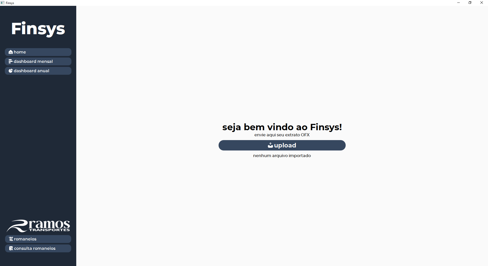
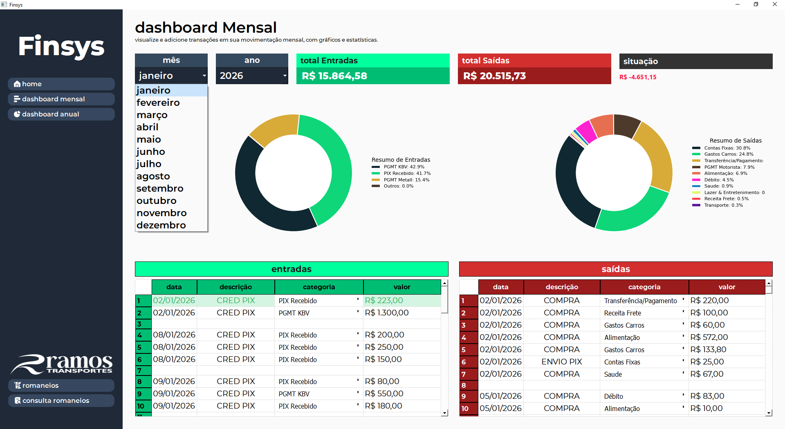
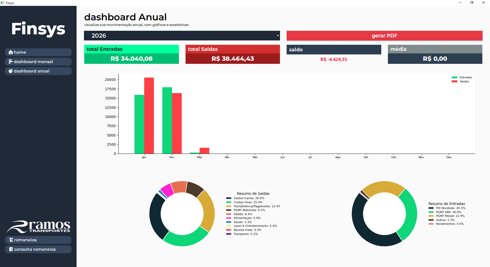

# FinSys

FinSys é um sistema desktop de **gestão e análise financeira** desenvolvido em Python.

O objetivo do projeto é transformar extratos bancários em dados estruturados, permitindo organizar movimentações financeiras, classificar transações e visualizar informações através de dashboards.

O sistema pode ser utilizado tanto por **usuários que desejam controlar suas finanças pessoais**, quanto por **pequenas empresas que precisam acompanhar entradas, saídas e fluxo financeiro**.

---

# Interface do sistema

## Tela principal

Visão geral do sistema com resumo financeiro e acesso às principais funcionalidades.



---

## Dashboard financeiro mensal

Visualização das movimentações financeiras de um mês específico, incluindo totais de entradas, saídas e saldo do período.



---

## Dashboard anual

Análise financeira consolidada de todo o ano, permitindo identificar padrões de gastos, categorias com maior impacto e comportamento financeiro ao longo dos meses.



---

# Principais funcionalidades

## Importação de extratos bancários (OFX)

O sistema permite importar extratos bancários no formato **OFX**, convertendo automaticamente as transações para registros estruturados no banco de dados.

Cada transação importada contém:

* data
* descrição
* valor
* tipo de movimentação (entrada ou saída)

---

## Organização das movimentações financeiras

Após a importação, o usuário pode visualizar todas as transações registradas em uma tabela organizada.

Isso permite acompanhar:

* histórico de movimentações
* valores recebidos
* despesas realizadas
* saldo financeiro

---

## Classificação de transações

As movimentações podem ser classificadas em categorias financeiras, permitindo uma organização mais clara dos dados.

Exemplos de categorias:

### Entradas

* PIX
* Juros

### Saídas

* Boletos
* Pagamentos governamentais
* Taxas
* Transferências

O sistema também permite que o usuário **defina categorias personalizadas**, classificando cada transação de acordo com sua necessidade.

---

## Seleção de período

O sistema permite filtrar as movimentações por **mês específico**, facilitando a análise financeira dentro de um determinado período.

Isso possibilita comparar:

* gastos mensais
* entradas por mês
* saldo por período

---

# Análise financeira

Com os dados organizados, o sistema permite gerar indicadores importantes como:

* total de entradas
* total de saídas
* saldo financeiro
* gastos por categoria
* movimentações por período
* análise anual de despesas

Essas informações são exibidas através de dashboards visuais que facilitam a interpretação dos dados.

---

# Tecnologias utilizadas

* Python 3
* PySide6 (Qt for Python)
* Qt Designer
* SQLite
* ReportLab
* OFX Parser

---

# Estrutura do projeto

```
projFinsys
│
├── src
│   └── main.py
│
├── ui
│   └── mainwindow.ui
│
├── assets
│   ├── logo.png
│   └── fonts
│
├── database
│   ├── romaneios.db
│   └── financeiro.db
│
├── exports
│   └── pdf
│
├── docs
│   └── screenshots
│       ├── home.png
│       ├── dashboard_mensal.png
│       └── dashboard_anual.png
│
└── README.md
```

---

# Fluxo de uso do sistema

O funcionamento básico do FinSys segue o fluxo abaixo:

1. Exportar o extrato bancário no formato OFX
2. Importar o arquivo no sistema
3. Visualizar as transações registradas
4. Classificar movimentações em categorias
5. Filtrar dados por mês
6. Analisar dashboards financeiros
7. Visualizar análise anual de gastos

---

# Módulo adicional (opcional)

O sistema também possui um módulo adicional voltado para **registro de serviços e geração de romaneios em PDF**.

Esse módulo foi desenvolvido para atender uma necessidade específica de uma empresa de transportes, permitindo registrar serviços realizados e gerar documentos de cobrança.

Atualmente esse módulo não é o foco principal do projeto, mas demonstra a capacidade de expansão da aplicação.

---

# Funcionalidades planejadas

Algumas melhorias planejadas incluem:

* classificação automática de transações baseada em regras
* dashboards financeiros mais avançados
* relatórios financeiros por período
* análise anual detalhada
* automação de categorização de extratos

---

# Tipo de aplicação

Aplicação **desktop administrativa**, desenvolvida em Python.

A escolha por uma aplicação desktop permite:

* uso simples sem necessidade de servidor
* acesso rápido a arquivos locais
* integração direta com extratos bancários
* geração de documentos em PDF

---

# Autor

Vinícius Ramos
Estudante de Ciência da Computação
